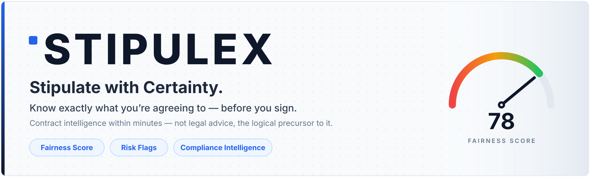
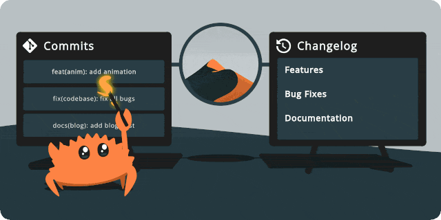
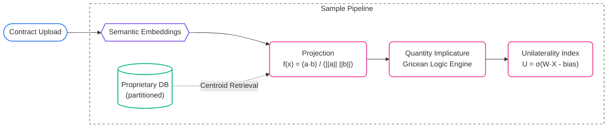

<div align="center">





# Don't just read the fine print. Command it.
<br>
Upload any contract, binding agreement, or terms of service. In seconds, Stipulex exposes hidden risks, delivers a definitive Fairness Score, and hands you a plain-English executive brief. Negotiate from a position of power. Know exactly what you're getting into before your pen hits the paper.<br><br>


[](mailto:hello@stipulex.com?subject=Stipulex%20demo)
[](https://www.stipulex.com)
[](mailto:hello@stipulex.com)

</div>

<div align="center">

<!-- START_DEVELOPMENT_ACTIVITY -->
Expected Soft Launch Nov 15th | Latest Development Activity: Sunday, Sep 16, 2026
<!-- END_DEVELOPMENT_ACTIVITY -->

</div>

---

## What is Stipulex?

Stipulex is a contract intelligence company. We built a dedicated validation engine that reads complex agreements and tells you exactly what you are signing in a matter of minutes. 

This goes far beyond a simple chat interface or a thin LLM wrapper. When you upload a vendor agreement, job offer, commercial lease, or SaaS contract, the Stipulex engine delivers:

* **A Fairness Score (0–100)** to instantly gauge leverage.
* **Plain-English risk flags** detailing severity and recommended actions.
* **Cross-jurisdiction-specific compliance intelligence** based on the laws that govern the agreement.
* **A concise executive brief** stripped of legal jargon and written for absolute clarity.

Stipulex is built for operators. Founders, finance teams, HR, and procurement professionals use our platform to get institutional-grade contract visibility at an SMB-friendly price. 

> **Note:** Stipulex provides contract intelligence, not legal advice. We provide the map; you provide the counsel.

---

## The problem we solve

The overwhelming majority of U.S. businesses sign contracts they never properly review — not because they don't care, but because real legal review is too slow and too expensive.

| **33M** | **83%** | **$700–900** | **$4.27B** |
|:---:|:---:|:---:|:---:|
| U.S. SMBs that lack institutional-grade contract tooling | of U.S. SMBs sign contracts without full legal review | per hour — typical attorney rate for contract review | AI contract-analysis market in 2026, growing **23.5%/yr** |

<sub>Sources: American Bar Association · LawGeex/Stanford · Market.us (2026).</sub>

Enterprise contract platforms are priced for corporate legal teams; general-purpose chatbots can't clear the accuracy bar for anything you'd actually sign. Stipulex is built for the gap in between.

---


## How It Works



Every clause is cross-referenced against verified statutory text **before** any model evaluation, so findings are grounded in real law—not a model's memory. Independent models cross-check each other, and a deterministic rule engine composes the final score.

## Sneak Peek -- Under the Hood: The Pipeline

Most "AI contract tools" just pass your document to an LLM prompt and hope for the best. Stipulex doesn't guess. We built a deterministic legal risk engine that evaluates contract clauses the same way a quant fund evaluates market volatility. 

Our architecture maps semantic embeddings to a strictly defined statistical vector space.

Here is a sneak peek at the somne of machinery powering Stipulex. We are perfectly fine sharing this scaffolding publicly—the actual proprietary IP, including our core regulatory routing algorithms, sits much deeper in the stack.

1. **Temperature-scaled softmax** over embedding similarity $\rightarrow$ *rule match*
2. **Shannon entropy** of the match distribution $\rightarrow$ *ambiguity gate*
3. **Logarithmic opinion pool** (log-odds fusion) $\rightarrow$ *multi-model consensus*
4. **Beta-Bernoulli conjugate update** $\rightarrow$ *historical reliability*
5. **Platt scaling** $\rightarrow$ *confidence calibration*
6. **Odds-ratio enforceability adjustment** $\rightarrow$ *jurisdiction posture*
7. **Lognormal loss model** with closed-form VaR and CVaR $\rightarrow$ *financial impact*

### Deterministic Leverage via Gricean Logic


```typescript
const NEUTRAL_BAND = 0.18;

function cosine(a: Float64Array, b: Float64Array): number {
  let dot = 0, na = 0, nb = 0;
  for (let i = 0; i < a.length; i++) { dot += a[i] * b[i]; na += a[i] * a[i]; nb += b[i] * b[i]; }
  return dot / (Math.sqrt(na) * Math.sqrt(nb) || 1);
}

function benefitAxis(embed: Embed): Float64Array {
  const dim = embed('increase').length;
  const axis = new Float64Array(dim);
  for (const [pos, neg] of PROTOTYPE_PAIRS) {
    const p = embed(pos), n = embed(neg);
    for (let i = 0; i < dim; i++) axis[i] += p[i] - n[i];
  }
  let norm = 0;
  for (let i = 0; i < dim; i++) norm += axis[i] * axis[i];
  norm = Math.sqrt(norm) || 1;
  for (let i = 0; i < dim; i++) axis[i] /= norm;
  return axis;
}

export type Polarity = 'FAVORABLE' | 'ADVERSE' | 'NEUTRAL';

function projectPolarity(term: string, axis: Float64Array, embed: Embed): { polarity: Polarity; value: number } {
  const value = cosine(embed(term), axis);
  if (value > NEUTRAL_BAND) return { polarity: 'FAVORABLE', value };
  if (value < -NEUTRAL_BAND) return { polarity: 'ADVERSE', value };
  return { polarity: 'NEUTRAL', value };
}

/* ================================================================== */
/* Stage: quantity implicature                   */
/* ================================================================== */

function implicature(
  exemplars: string[],
  exhaustive: boolean,
  axis: Float64Array,
  embed: Embed,
): { impliedAdverse: boolean; disclosedAdverse: boolean; note: string } {
  if (exemplars.length === 0 || exhaustive) {
    return { impliedAdverse: false, disclosedAdverse: false, note: exhaustive ? 'Exhaustivity marker closes the set.' : 'No exemplar set; direction stays open but undisclosed.' };
  }
  const ps = exemplars.map(e => projectPolarity(e, axis, embed).polarity);
  const allFav = ps.every(p => p === 'FAVORABLE');
  const anyAdv = ps.some(p => p === 'ADVERSE');
  
  if (allFav) return { impliedAdverse: true, disclosedAdverse: false, note: 'Subset operator scopes favorable-only exemplars over a neutral predicate; adverse remainder implied by quantity implicature.' };
  if (anyAdv) return { impliedAdverse: false, disclosedAdverse: true, note: 'Adverse exemplar disclosed explicitly.' };
  
  return { impliedAdverse: false, disclosedAdverse: false, note: 'Exemplars directionally neutral.' };
}

/* ================================================================== */
/* Stage: constraints and unilaterality index                         */
/* ================================================================== */

interface Constraints {
  mutualConsent: boolean;
  objectiveCriteria: boolean;
  bounded: boolean;
  noticeOnly: boolean;
}

const U_W = { m: 1.6, c: 1.4, k: 0.9, b: 1.1, n: 0.3, bias: 2.2 };

function unilateralityIndex(discretion: number, k: Constraints): number {
  const z =
    U_W.m * discretion +
    U_W.c * (k.mutualConsent ? 0 : 1) +
    U_W.k * (k.objectiveCriteria ? 0 : 1) +
    U_W.b * (k.bounded ? 0 : 1) -
    U_W.n * (k.noticeOnly ? 1 : 0) -
    U_W.bias;
  return 1 / (1 + Math.exp(-z));
}
```

Stipulex computes leverage using a deterministic Unilaterality Index ($U$). Discretionary modality ($d$) raises the risk score, while actual constraints ($c, k, b$) lower it.

$$U = \frac{1}{1 + e^{-(w_m d + w_c(1 - c) + w_k(1 - k) + w_b(1 - b) - w_n n - 2.2)}}$$

<br>Because we project terms against value-family centroids, the engine catches phrases like "subject to annual CPI cap" as a mathematical constraint—without relying on fragile regex or simple keyword matching.

### Gaussian Distribution Numerical Primitives: Quantile Approximations

```typescript
/* ================================================================== */
/* Numerics: normal distribution primitives                           */
/* ================================================================== */

/** Error function, Abramowitz & Stegun 7.1.26. |eps| <= 1.5e-7. */
function erf(x: number): number {
  const sign = x < 0 ? -1 : 1;
  const ax = Math.abs(x);
  const t = 1 / (1 + 0.3275911 * ax);
  const y =
    1 -
    (((((1.061405429 * t - 1.453152027) * t) + 1.421413741) * t -
      0.284496736) * t +
      0.254829592) *
      t *
      Math.exp(-ax * ax);
  return sign * y;
}

/** Standard normal CDF. */
const phi = (x: number): number => 0.5 * (1 + erf(x / Math.SQRT2));

/** Inverse standard normal CDF, Acklam's rational approximation.
 *  |relative eps| < 1.15e-9 on (0,1). */
function phiInv(p: number): number {
  if (p <= 0 || p >= 1) throw new RangeError('phiInv domain');
  
  const a = [-3.969683028665376e1, 2.209460984245205e2, -2.759285104469687e2,
             1.383577518672690e2, -3.066479806614716e1, 2.506628277459239e0];
  const b = [-5.447609879822406e1, 1.615858368580409e2, -1.556989798598866e2,
             6.680131188771972e1, -1.328068155288572e1];
  const c = [-7.784894002430293e-3, -3.223964580411365e-1, -2.400758277161838e0,
             -2.549732539343734e0, 4.374664141464968e0, 2.938163982698783e0];
  const d = [7.784695709041462e-3, 3.224671290700398e-1, 2.445134137142996e0,
             3.754408661907416e0];
  const pl = 0.02425;

  let q: number, r: number;
  if (p < pl) {
    q = Math.sqrt(-2 * Math.log(p));
    return (((((c[0] * q + c[1]) * q + c[2]) * q + c[3]) * q + c[4]) * q + c[5]) /
           ((((d[0] * q + d[1]) * q + d[2]) * q + d[3]) * q + 1);
  }
  if (p <= 1 - pl) {
    q = p - 0.5;
    r = q * q;
    return (((((a[0] * r + a[1]) * r + a[2]) * r + a[3]) * r + a[4]) * r + a[5]) * q /
           (((((b[0] * r + b[1]) * r + b[2]) * r + b[3]) * r + b[4]) * r + 1);
  }
  q = Math.sqrt(-2 * Math.log(1 - p));
  return -(((((c[0] * q + c[1]) * q + c[2]) * q + c[3]) * q + c[4]) * q + c[5]) /
          ((((d[0] * q + d[1]) * q + d[2]) * q + d[3]) * q + 1);
}

const logit = (p: number): number => Math.log(p / (1 - p));
const sigmoid = (z: number): number => 1 / (1 + Math.exp(-z));

```

Rather than relying on vague LLM sentiment, Stipulex calculates explicit financial exposure and confidence intervals using a Standard Normal Cumulative Distribution Function ($\Phi(x)$), driven by the Abramowitz and Stegun error function approximation:

$$\Phi(x) = \frac{1}{2} \left[ 1 + \text{erf}\left( \frac{x}{\sqrt{2}} \right) \right]$$

<br>This ensures that when our pipeline flags a clause as "High Risk," it's not a hallucination—it is a mathematically verified probability distribution backed by jurisdictional enforceability data.


---

## What you get

| | |
|---|---|
| **Fairness Score (0–100)**<br/>A single, memorable metric for clause balance, market deviation, and regulatory posture — in place of a $700/hr legal opinion. | **Deterministic risk flags**<br/>Plain-English identification of problematic clauses, each with a severity rating and a recommended action. |
| **Compliance intelligence**<br/>Real-time cross-referencing against federal law, state statutes, and county ordinances via a purpose-built database. | **Zero-retention privacy**<br/>Contract content is never stored, logged, or used for training. TLS 1.3 in transit, AES-256 at rest. |
| **Instant reports**<br/>A 300–500 word executive summary plus annotated PDF / DOCX output, generated once and served instantly. | **Analysis within minutes**<br/>A full multi-stage review within minutes — speed is an architectural outcome, not a shortcut. |

---

## Why Stipulex is different

The AI is one input. The **data** and the **deterministic engine** around it are the moat.

- **Proprietary jurisdiction compliance database** — curated statutory and regulatory data at the state and county level, beginning with California and federal law. General-purpose models simply don't contain this.
- **Deterministic cross-reference engine** — rule-based clause matching, jurisdiction-rule injection, structured-output validation, and Fairness Score composition. Structural, not probabilistic.
- **Structural hallucination defense** — multiple independent models are cross-checked against the compliance data and scoring engine, so fabrication is architecturally contained, not just disclaimed.
- **Built for operators** — institutional-grade depth, delivered at a price and reading level the 33M-strong SMB market can actually use.

---

## Engineering standards

We build toward the compliance requirements ahead — without gold-plating controls the current phase doesn't need. Every architectural decision leaves a seam for the next requirement.

| Principle | What that means in the codebase |
|---|---|
| **Reliability** | Infrastructure-level rate limiting shared across processes and surviving restarts · compliance data cached with a fail-open posture so a cache outage never blocks an analysis · reports rendered once and served instantly · query performance instrumented from day one |
| **Jurisdiction coverage** | Hundreds of compliance rules spanning standard and non-standard clause language — catching both verbatim statutory wording and paraphrased clauses that avoid exact keywords |
| **Authentication** | A full in-house auth stack — industry-standard credential management, one-time token flows, server-side sessions, per-identity rate limiting, and brute-force protection across every credential endpoint |
| **Privacy & observability** | Default zero-retention posture · PII and document content redacted before anything is logged · structured logging for standard tooling · all AI-provider connections governed centrally (DPA enforcement, zero-training flags, audit hooks) |
| **Correctness** | TypeScript strict mode end-to-end with zero `any` suppressions · runtime validation at every boundary · boot-time configuration validation · a hard ceiling on analysis time so no job runs away |

---

## Trust & security posture

Zero-retention by default · **TLS 1.3** in transit · **AES-256** at rest · centralized AI-provider governance. Engineered for regulated-industry adoption and building toward **SOC 2 Type II** · **HIPAA** · **FedRAMP**.

---


## Recent updates

- **In-house authentication** — replaced a third-party auth library (removed over a CVE in its dependency tree) with a purpose-built stack: credential management, one-time expiring tokens, server-side sessions, and invite-gated account flows.
- **Distributed rate limiting** — now enforced at the infrastructure level, shared across all processes and surviving restarts.
- **Resilient compliance caching** — the jurisdiction ruleset is cached fail-open; if the cache is unavailable, the engine falls through transparently and no analysis is blocked.
- **Broader clause matching** — the engine now catches paraphrased clauses that don't use exact statutory keywords, not just verbatim matches.
- **Centralized AI-provider governance** — all external model connections flow through one module (DPA enforcement, zero-training flags, audit hooks, failover), with structured logging and boot-time configuration validation.

---

## Founder

**Tony Sodano**, Founder and CEO. Twenty-plus years in software engineering through executive roles, including CIO at iHEAR Medical (maker of the first FDA-cleared over-the-counter home hearing screener) and VP of Technology at InnerScope Hearing Technologies, with compliance scope spanning FDA 510(k), HIPAA, and ISO 13485. Stipulex applies that regulated-industry discipline to contract intelligence.

---

## Contact

**[▶ Get a demo](mailto:hello@stipulex.com?subject=Stipulex%20demo)** &nbsp;·&nbsp; hello@stipulex.com &nbsp;·&nbsp; [www.stipulex.com](https://www.stipulex.com)

---

<div align="center">

**Stipulex decodes the architecture of your agreements.**
<br>
*We provide the map; you provide the counsel.*
*Not legal advice — just the most logical precursor to it.*

<sub>Stipulex output is engine-generated analysis, not legal advice. Consult licensed counsel for jurisdiction-specific decisions.</sub>

<sub>© 2026 Stipulex, Inc. · Redwood City, California</sub>

</div>
